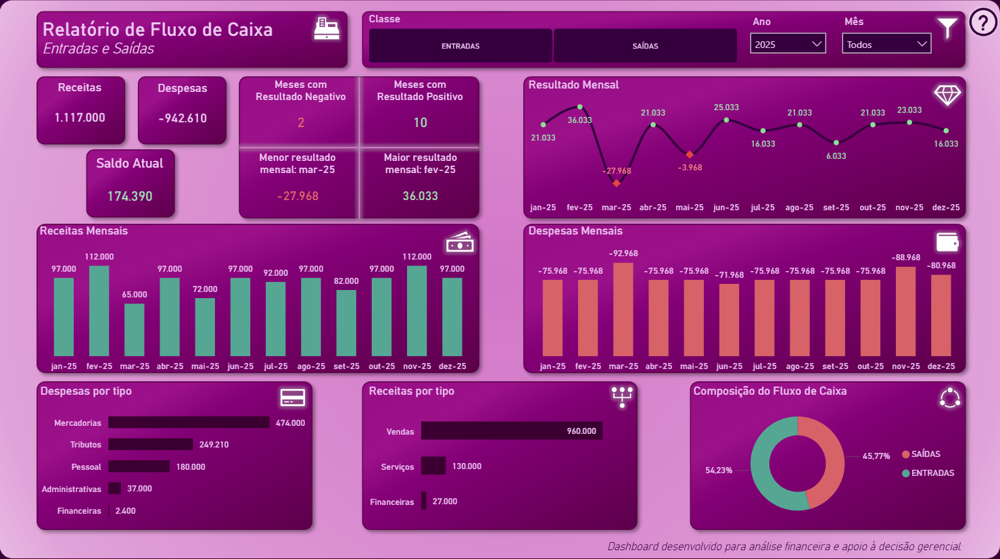

# Dashboard de Fluxo de Caixa

Projeto de análise de fluxo de caixa desenvolvido em Power BI, com foco em análise financeira e apoio à tomada de decisão gerencial.

## 🎯 Objetivo
Analisar entradas e saídas de caixa, identificar meses com resultado negativo e compreender a composição do fluxo financeiro.

## 📊 Principais Análises
- Resultado mensal com destaque para meses negativos
- Análise de receitas e despesas mensais
- Composição de receitas e despesas por tipo
- Indicadores de saldo e desempenho

## 🛠 Ferramentas Utilizadas
- Power BI (DAX e Dashboard)
- Excel (Estrutura e Dados)
- PowerPoint (Design)

## 📂 Estrutura do Projeto
- `data/` → Base de dados em Excel  
- `images/` → Imagens do dashboard  
- `dashboard-fluxo-caixa.pbix` → Arquivo Power BI

## 🖼️ Preview do Dashboard

